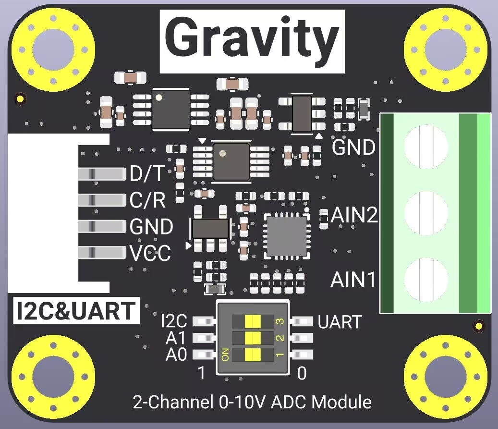

# DFRobot_ADS1115_0_10V
- [中文版](./README_CN.md)

The product is a module that integrates the ADS1115 chip. The I2C and UART communication modes can be selected by the dial switch, and the I2C address of the module can also be switched by the dial switch. The external device can obtain two sets of voltage data with a resolution of 0.01mv through the gravity interface. This module can be used to accurately measure the DC voltage from 0 to 10v.

 

## Product Link(https://www.dfrobot.com/)

## Table of Contents

* [Summary](#Summary)
* [Installation](#Installation)
* [Methods](#Methods)
* [Compatibility](#Compatibility)
* [History](#History)
* [Credits](#Credits)

## Summary

  * Get the voltage and choose to get the voltage of channel 1 or channel 2
  * Measurement voltage accuracy, 0.01mv


## Installation
Here's one way to use this library:
1. First download the library file, paste it into the \Arduino\libraries directory, then open the examples folder and run the demo inside that folder.


## Methods

```C++

  /**
   * @fn begin
   * @brief  Initializes the communication method
   * @return Returns the initial state
   * @retval Ture no Eerro
   */
  uint8_t begin(void);

  /**
   * @fn get_value(uint8_t channel)
   * @brief Getting voltage values
   * @param select channel 1/ channel 2
   * @note You can only enter 1 or 2, and any other values will always return 0
   * @return voltage values
   */
  uint32_t get_value(uint8_t channel);
```

## Compatibility

MCU                | Work Well    |   Work Wrong    | Untested    | Remarks
------------------ | :----------: | :-------------: | :---------: | :----:
Arduino Uno        |      √       |                 |             |
Arduino MEGA2560   |      √       |                 |             |
Arduino Leonardo   |      √       |                 |             |
FireBeetle-ESP32   |      √       |                 |             |
FireBeetle-ESP8266 |      √       |                 |             |
FireBeetle-M0      |      √       |                 |             |
RaspberryPi4       |      √       |                 |             |

## History

- 2024/07/23 - Version 1.0.0 released.

## Credits

Written by lr(rong.li@dfrobot.com), 2024. (Welcome to our [website](https://www.dfrobot.com/))
