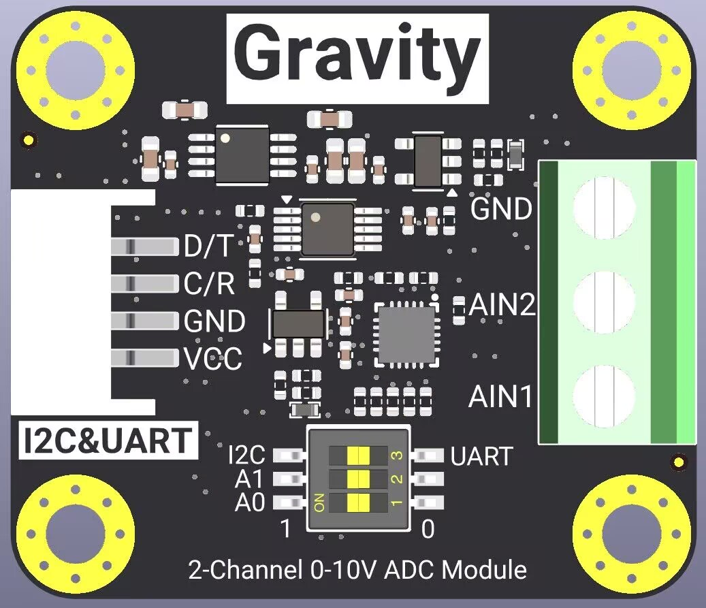

# DFRobot_ADS1115_0_10V
- [English Version](./README.md)

该产品是一款集成了ADS1115芯片的模块。可通过拨码开关的方式选择I2C、UART通讯方式，也可以通过拨码开关切换模块的I2C地址。外部设备通过gravity接口可以分别获取两组分辨率为0.01mv的电压数据。该模块可以用来精确测量0-10v的直流电压。

 

## 产品链接(https://www.dfrobot.com.cn/)

## 目录

* [概述](#概述)
* [库安装](#库安装)
* [方法](#方法)
* [兼容性](#兼容性y)
* [历史](#历史)
* [创作者](#创作者)

## 概述

  * 获取电压，选择获取通道1或通道2的电压
  * 测量电压精度，0.01mv


## 库安装
这里提供一种使用本库的方法：<br>
1.首先下载库文件,将其粘贴到\Arduino\libraries目录中,然后打开examples文件夹并在该文件夹中运行演示.<br>


## 方法

```C++

  /**
   * @fn begin
   * @brief 初始化通讯方式
   * @return 返回初始化状态
   * @retval Ture no Eerro
   */
  uint8_t begin(void);

  /**
   * @fn get_value(uint8_t channel)
   * @brief 获取电压值
   * @param 选择通道1/通道2 
   * @note 只能输入1或2，其他值会一直返回0
   * @return 电压值
   */
  uint32_t get_value(uint8_t channel);
```
## 兼容性

MCU                | Work Well    |   Work Wrong    | Untested    | Remarks
------------------ | :----------: | :-------------: | :---------: | :----:
Arduino Uno        |      √       |                 |             |
Arduino MEGA2560   |      √       |                 |             |
Arduino Leonardo   |      √       |                 |             |
FireBeetle-ESP32   |      √       |                 |             |
FireBeetle-ESP8266 |      √       |                 |             |
FireBeetle-M0      |      √       |                 |             |
RaspberryPi4       |      √       |                 |             |

## 历史

- 2024/07/23 - V1.0.0 版本

## 创作者

Written by lr(rong.li@dfrobot.com), 2024. (Welcome to our [website](https://www.dfrobot.com/))